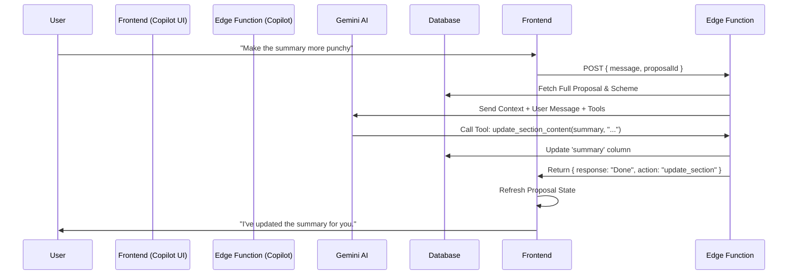

# 🤖 Architecture Plan: Proposal Copilot (Agentic AI)

**Goal:** Transform the application from a static proposal generator into an interactive "Copilot" that can understand the full project context and perform specific actions (edits, budget adjustments, partner recommendations) based on user chat commands.

---

## 1. Core Concept: The "Agentic" Loop

Instead of a simple Request -> Response flow, we will implement a loop where the AI can "reason" and "act".

1.  **User Input:** "Reduce travel budget by 10%."
2.  **Context Loading:** System loads Proposal + Funding Scheme + Partners.
3.  **Reasoning (Gemini):** AI analyzes the request against the data.
4.  **Tool Selection:** AI decides to call `update_budget_item`.
5.  **Execution:** The system executes the tool and updates the database/state.
6.  **Response:** AI confirms the action to the user.

---

## 2. Technical Components

### A. Frontend: The Copilot Sidebar (`ProposalCopilot.tsx`)
A new persistent sidebar component in the `ProposalViewerPage`.

*   **UI:** Chat interface (User messages vs. AI responses).
*   **State:** Maintains conversation history.
*   **Action Handling:** Listens for "Tool Events" from the backend to update the local React state (e.g., if AI updates the budget, the frontend budget table must refresh).

### B. Backend: The Agent Endpoint (`supabase/functions/proposal-copilot`)
A dedicated Edge Function to handle the logic.

*   **Model:** Gemini 1.5 Pro (or Flash for speed) with **Function Calling** enabled.
*   **System Prompt:** A robust prompt defining the AI's persona ("Expert EU Consultant") and its capabilities.
*   **Context Builder:** A utility to package the `FullProposal` object into a token-efficient JSON string.

### C. The Toolset (Function Definitions)
We will define specific JSON schemas for the tools the AI can use.

| Tool Name | Description | Parameters |
| :--- | :--- | :--- |
| `update_section_content` | Rewrites a specific narrative section. | `sectionId` (string), `newContent` (html string), `reasoning` (string) |
| `update_budget_category` | Adjusts a budget category's total or items. | `categoryName` (string), `adjustmentPercentage` (number), `newTotal` (number) |
| `add_partner_recommendation` | Suggests a partner type based on gaps. | `role` (string), `requiredSkills` (string[]) |
| `critique_proposal` | Reviews the proposal against funding rules. | `focusArea` (string - e.g., "impact", "budget") |
| `check_constraints` | Verifies character limits and budget caps. | None |

---

## 3. Data Flow

---

## 4. Implementation Steps

### Phase 1: Context & Endpoint Setup
1.  Create `supabase/functions/proposal-copilot/index.ts`.
2.  Implement `buildProposalContext(proposal, scheme)` helper.
3.  Set up the basic Gemini chat completion loop.

### Phase 2: Tool Definitions
1.  Define the `tools` array in the Gemini API call.
2.  Implement the `handleToolCall` logic in the Edge Function to actually perform DB updates (using Supabase client).

### Phase 3: Frontend UI
1.  Create `components/ProposalCopilot.tsx`.
2.  Integrate it into `ProposalViewerPage.tsx` (collapsible sidebar).
3.  Implement the "Optimistic UI" or "Refresh" logic to show changes immediately.

### Phase 4: Advanced Reasoning (The "Brain")
1.  Refine the System Prompt to understand "EU Funding Speak" (Impact, Dissemination, etc.).
2.  Add "Validation" tools so the AI checks its own work (e.g., "Did I exceed the character limit?").

---

## 5. Future Possibilities
*   **"Auto-Fix":** One button to "Fix all validation errors".
*   **"Partner Matcher":** AI scans your `partners` table and suggests specific organizations.
*   **"Budget Balancer":** "I have €50k left, where should I put it?" -> AI suggests distribution based on project type.

---

**Status:** Planning Phase
**Next Action:** Begin Phase 1 (Endpoint Setup).
